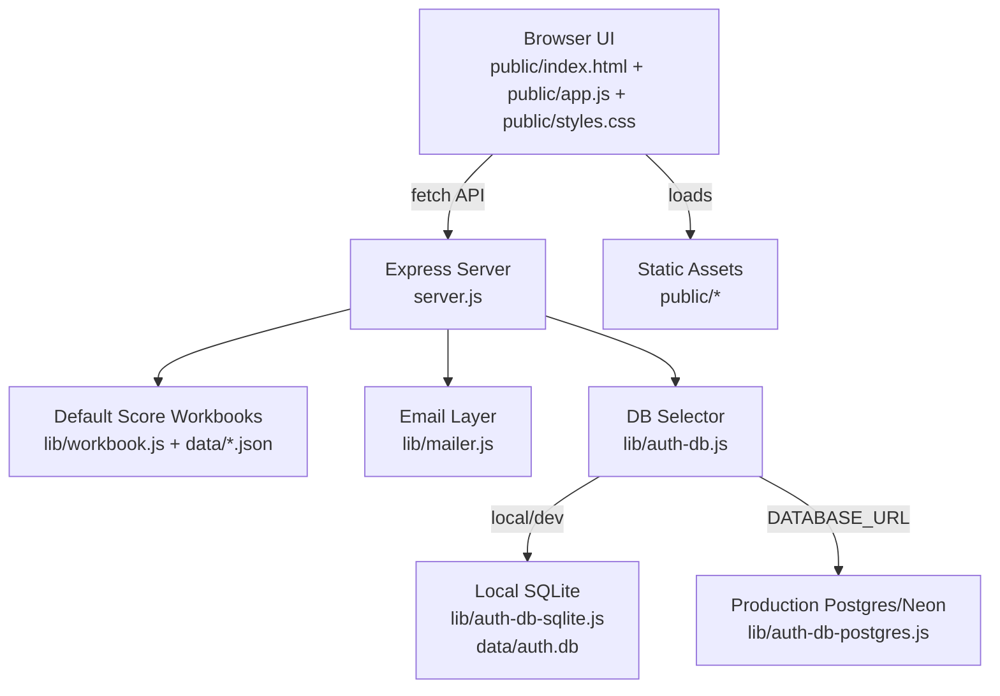
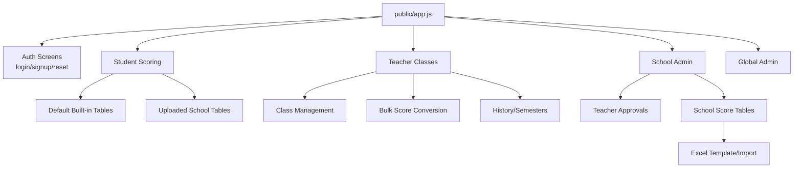
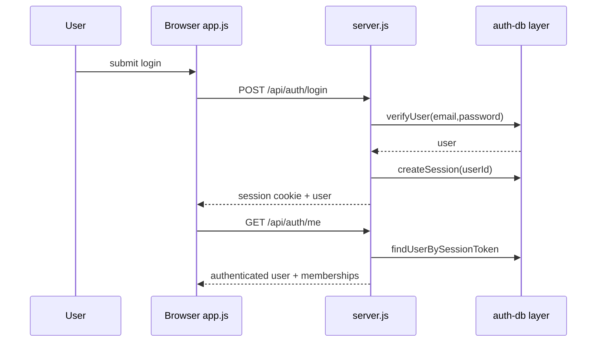
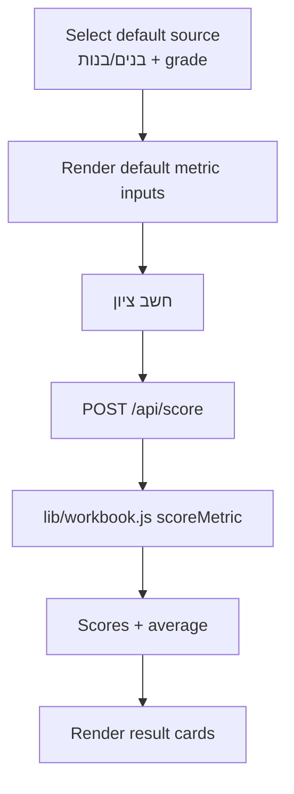
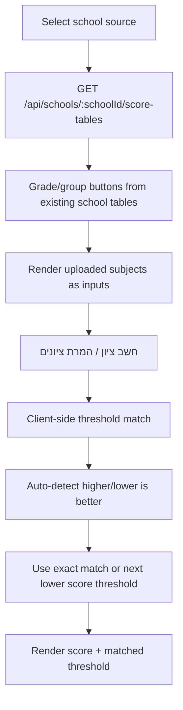
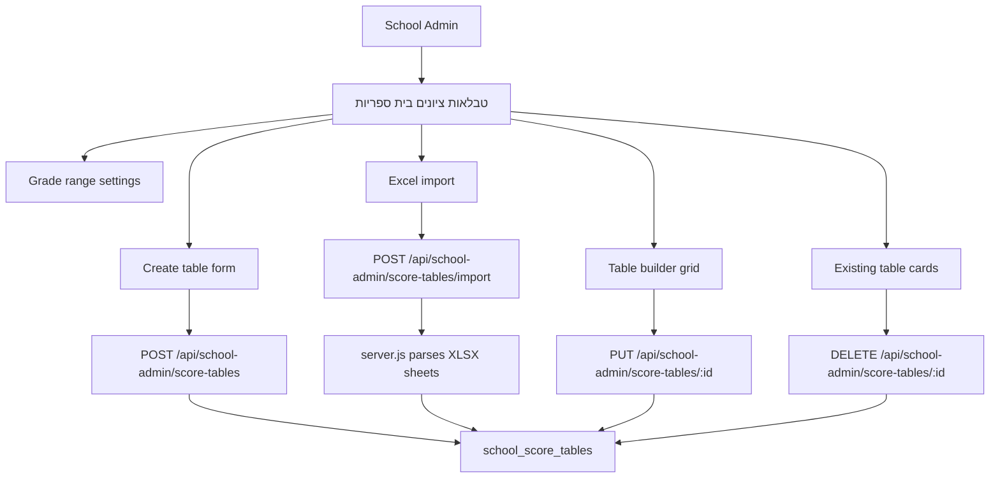
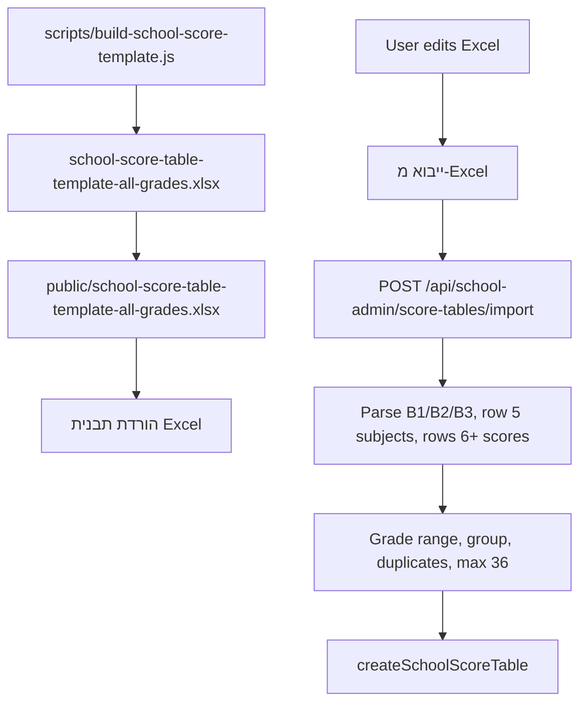
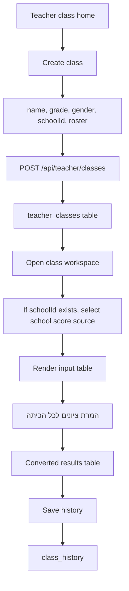
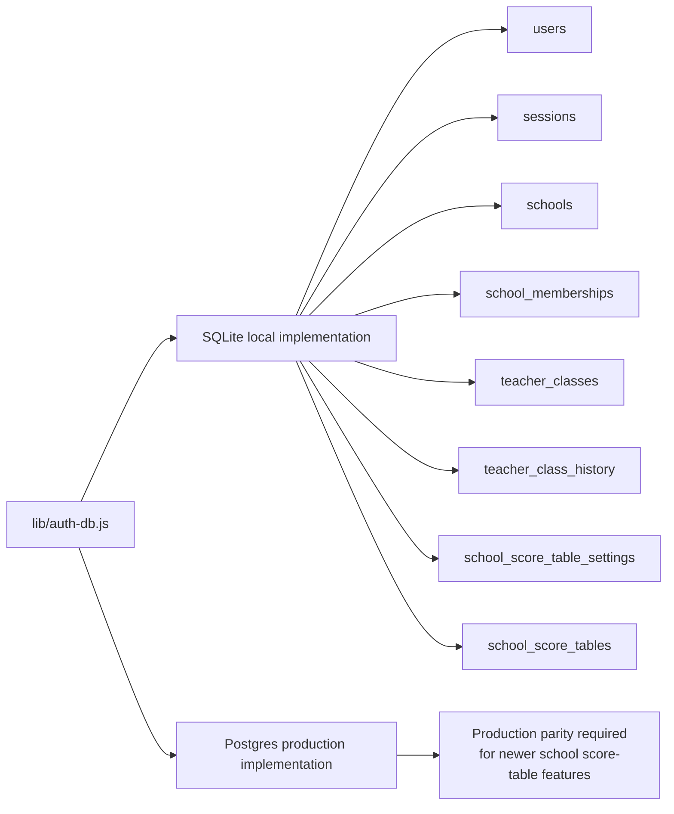

# EduFitScore Architecture

## System Map

## Main Frontend Areas

## Auth And Session Flow

## Default Student Scoring Flow

## Uploaded School Table Scoring Flow

## School Admin Score Table Management

## Excel Template And Import

## Teacher Class Workflow

## Database Split

## Important Local-Only Gap

The school-admin score-table workflow is currently implemented locally in SQLite. Before pushing this workflow to production, the matching PostgreSQL/Neon implementation must be completed in `lib/auth-db-postgres.js`.
